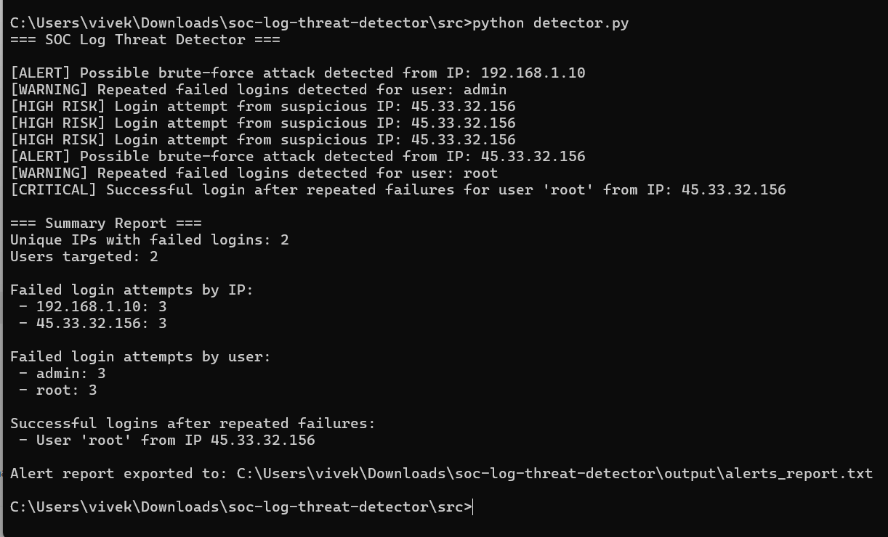
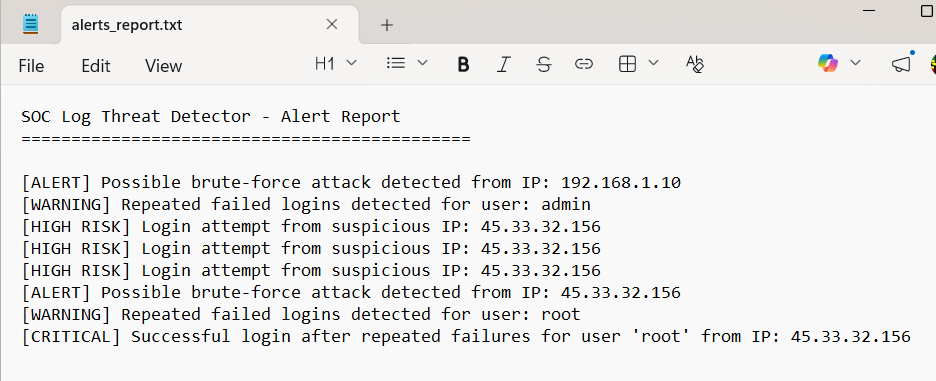

# SOC Log Threat Detector

## Overview
SOC Log Threat Detector is a beginner-friendly Python cybersecurity project that simulates a basic Security Operations Center (SOC) workflow. The tool analyzes authentication logs and detects suspicious activity such as brute-force attacks, repeated failed login attempts, suspicious IP addresses, and successful logins after repeated failures.

## Features
- Detects possible brute-force attacks based on repeated failed login attempts
- Identifies repeated failed logins targeting the same user
- Flags suspicious IP addresses
- Detects successful logins after repeated failures
- Generates a summary report
- Exports alerts to a text report file

## Technologies Used
- Python
- Regular Expressions
- Log Analysis
- Basic Threat Detection Logic

## Project Output

### Detection Output


### Alert Report File


## Project Structure
```text
soc-log-threat-detector/
│
├── logs/
│   └── sample.log
├── src/
│   └── detector.py
├── output/
├── README.md
├── requirements.txt
└── .gitignore
